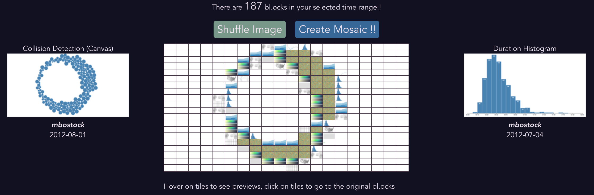

# blocks-parade
This is my submission to the d3-parade hackathon https://d3js.community/d3-parade-2021.

We celebrate 10 years of D3 by looking back at the wonderful bl.ocks created over the past decade and create interesting mosaics from these visualizations.





## Running
```
npm run serve
```

## Data processing
The dataset used is via https://observablehq.com/@enjalot/blockbuilder-search-data?ui=classic, specifically the blocks-min dataset (https://storage.googleapis.com/bb-search-data/parsed/blocks-min.json).

There are a little over 40k bl.ocks in the dataset, of which the ones with no thumbnails are filtered out in the preprocessing, leaving about 10k bl.ocks that are used in this application.


## Future work?
Scrapping all available bl.ocks and save their output as images would be a nice to have, a full completed dataset.
